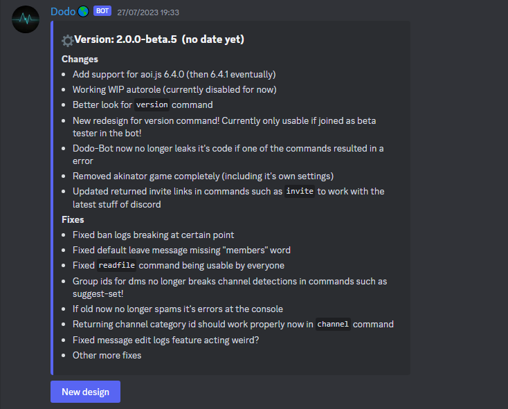

# Dodo-Bot

## Old design of version command

In versions between 1.0.1 and 1.3.9, the command `version` was mostly using text to show on what was changed in each version. In the version 1.4.0 of Dodo-Bot (For BDFD), the `version` command content was changed to use embeds.

<figure><figcaption>
Preview of old design of version command.
</figcaption></figure>

## Music system

Originally in 1.5.9 of Dodo-Bot, there was going to be a music system which was unfinished and had a few commands like `play`. However, due to most of the hosts not allowing music alongside with discord banning music bots, this ended up being removed entirely in a later build of 1.5.9.

## Slash Rewrite

Back when Dodo-Bot v1 wasn't finished, there was going to be a ENTIRE rewrite for the bot to migrate to use slash commands in 1.8.0 but this ended up being cancelled.

## Youtube Command

In Dodo-Bot v1, there was a command called `yt` which allowed people to search for information about an video on youtube. This was removed in v2 considering the fact that the api used for yt command no longer works.

<figure><figcaption>
Preview of youtube command.
</figcaption></figure>

## Old v2

Old v2 previously known as Re-work or Restarted was an attempt to move away from v1 which was a bad start but ended up getting replaced by the current v2 as the purpose of the bot was changed from multi-purpose to just entertainment bot starting in beta 2.

Despite this, current v2 still calls itself as Re-work especially in `info` command.

## Old version command (second design)

Since version 1.4.0, the command was using embeds since then. However, starting from the latest build of Dodo-Bot v2 beta 5, All of the changes are no longer listed in one embed and instead changes such as bug fixes and improvements has been moved to their own buttons.

<figure><figcaption>
Second design of version command.
</figcaption></figure>

<figure><figcaption>
The new third design of the version command.
</figcaption></figure>

## The akinator game

Since Dodo-Bot v1 for aoi.js version was actively worked on, it had a game called akinator where you could play the well known game but on discord without any problems. Sadly, it no longer works properly later sometime in 2023 and has been eventually removed in Dodo-Bot v2 beta 5 builds.
